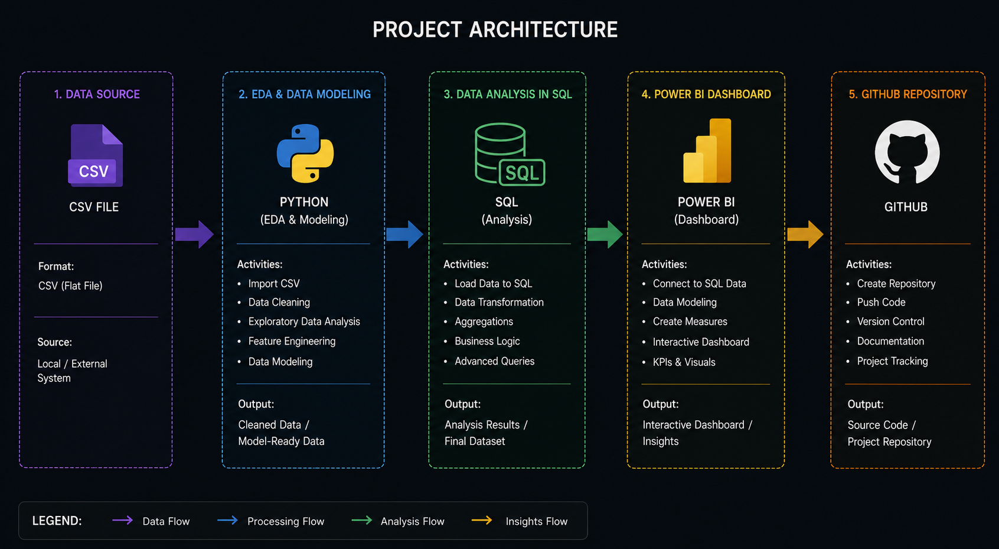
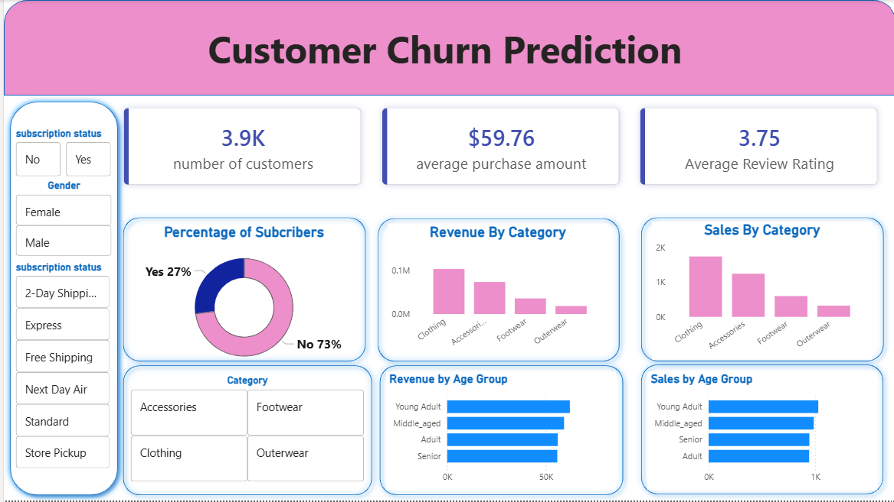

# 🔄 Customer Churn Prediction

> An end-to-end **Customer Churn Prediction** analytics pipeline — from raw CSV data to an interactive Power BI dashboard — built with **Python**, **SQL Server**, and **Power BI** to identify at-risk customers and drive retention strategies.

---

## 🏗️ Project Architecture

The project follows a structured 5-stage pipeline from raw data to business-ready insights.



| Stage | Tool | Description |
|---|---|---|
| 1️⃣ **Data Source** | CSV File | Raw customer shopping behaviour data |
| 2️⃣ **EDA & Modelling** | Python · Jupyter | Data cleaning, exploration, feature engineering |
| 3️⃣ **Data Analysis** | SQL Server · Docker | Deep-dive queries, segmentation, business logic |
| 4️⃣ **Dashboard** | Power BI | Interactive KPI dashboard with visuals & slicers |
| 5️⃣ **Version Control** | GitHub | Source code, documentation & project tracking |

---

## 📖 Project Overview

Customer churn is one of the most critical challenges for subscription-based and retail businesses — retaining an existing customer is far less expensive than acquiring a new one.

This project builds a complete analytics pipeline to identify customers at risk of churning and surface actionable business insights across customer segments, product categories, and age groups.

**What's built:**
- Python-based EDA with data cleaning, exploration and feature engineering
- SQL Server scripts for 10 business questions covering segmentation, trends and rankings
- Interactive Power BI dashboard connected live to SQL Server
- Clean, structured GitHub repo with full documentation

---

## 📊 Power BI Dashboard

The final deliverable is an interactive Power BI dashboard surfacing key churn insights.



**Key KPIs:**

| Metric | Value |
|---|---|
| Total Customers | 3,900 |
| Average Purchase Amount | $59.76 |
| Average Review Rating | 3.75 / 5 |
| Subscribers | 27% |
| Non-Subscribers | 73% |

**Dashboard visuals:**
- Revenue & Sales by product category — Clothing, Accessories, Footwear, Outerwear
- Revenue & Sales by age group — Young Adult, Middle-aged, Adult, Senior
- Subscription vs non-subscription spend comparison
- Gender-based revenue split
- Discount impact on purchase behaviour

---

## 🔍 SQL Analysis — Business Questions Answered

10 business questions answered using pure SQL on the customer dataset:

| # | Question |
|---|---|
| Q1 | Total revenue generated by male vs female customers |
| Q2 | Customers who used a discount but still spent above average |
| Q3 | Top 5 products with the highest average review rating |
| Q4 | Average purchase amount — Standard vs Express shipping |
| Q5 | Do subscribers spend more? Revenue and avg spend comparison |
| Q6 | Top 5 products with the highest discount usage rate |
| Q7 | Customer segmentation — New, Returning, and Loyal |
| Q8 | Top 3 most purchased products within each category |
| Q9 | Are repeat buyers more likely to subscribe? |
| Q10 | Revenue contribution by age group |

---

## 📂 Repository Structure

```
customer_churn_prediction/
│
├── dataset/                             # Raw CSV source data
│
├── docs/                                # Architecture diagrams & screenshots
│   ├── architechture.png                # End-to-end project architecture
│   └── Customer_churn_prediction.png    # Power BI dashboard screenshot
│
├── scripts/
│   ├── eda_notebook.ipynb               # Jupyter Notebook — EDA & Data Modelling
│   └── analysis.sql                     # SQL Server scripts — 10 business questions
│
├── README.md
└── LICENSE
```

---

## 🛠️ Tools & Technologies

| Tool | Purpose |
|---|---|
| **Python · Jupyter** | EDA, data cleaning, feature engineering, visualisation |
| **Pandas · Matplotlib · Seaborn** | Data manipulation and visual exploration |
| **SQL Server · SSMS** | Data loading, transformation, business queries |
| **Docker** | Running SQL Server locally in a container |
| **Power BI Desktop** | Interactive dashboard, DAX measures, KPIs |
| **Git · GitHub** | Version control and portfolio documentation |

---

## 🚀 How to Run

1. **Clone the repo**
   ```bash
   git clone https://github.com/ChanakyaSreeHarshaG/customer_chrun_prediction.git
   ```

2. **Install Python dependencies**
   ```bash
   pip install pandas numpy matplotlib seaborn scikit-learn jupyter
   ```

3. **Run the EDA Notebook**
   ```bash
   jupyter notebook scripts/eda_notebook.ipynb
   ```

4. **Set up SQL Server** — Start your Docker SQL Server container, open SSMS, create the database, and load data using the Jupyter notebook connection script

5. **Run SQL analysis** — Open `scripts/analysis.sql` in SSMS and run each query to explore business insights

6. **Open Power BI Dashboard** — Open the `.pbix` file in Power BI Desktop, update the SQL Server connection to `localhost,1433`, and refresh the data

---

## 💡 Key Business Insights

- **73%** of customers are non-subscribers — the largest at-risk segment for churn
- **Clothing** generates the highest revenue and sales volume across all categories
- **Young Adults and Middle-aged** customers drive the most revenue
- **Seniors** show lower purchase volumes — an opportunity for targeted retention campaigns
- Customers who used discounts but still spent above average indicate **high-value price-sensitive buyers**
- Repeat buyers (5+ purchases) show a strong correlation with subscription status

---

## 🛡️ License

This project is licensed under the [MIT License](LICENSE).

---

## 🙋 About Me

Hi, I'm **Chanakya Sree Harsha G** — a data enthusiast passionate about building end-to-end analytics solutions that turn raw data into real business insights.

Feel free to connect on [LinkedIn](https://www.linkedin.com/in/chanakyasreeharsha) or explore more of my work on [GitHub](https://github.com/ChanakyaSreeHarshaG).
